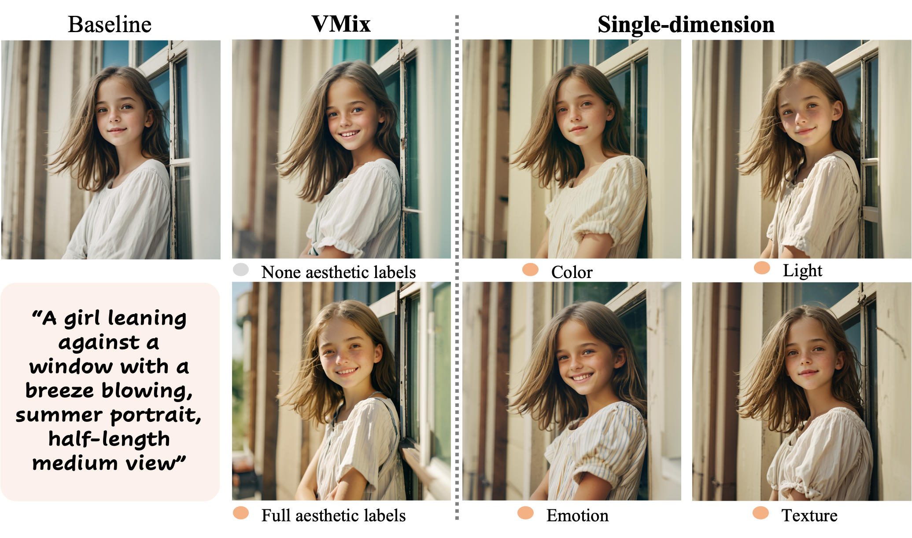

<h1 align="center">VMix: Improving Text-to-Image Diffusion Model with Cross-Attention Mixing Control</h1>

  

>
 Shaojin Wu,1</a>  Fei Ding,1,*</a> Mengqi Huang,1,2</a>  Wei Liu,1 </a>  Qian He1</a>   
>1 ByteDance Inc. &nbsp;&nbsp;2 University of Science and Technology of China

<table><tr>
<td></td>
<td></td>
</tr></table>

### 📖 Introduction
We propose VMix, a plug-and-play aesthetics adapter, to upgrade the quality of generated images while maintaining generality across visual concepts by (1) disentangling the input text prompt into the content description and aesthetic description by the initialization of aesthetic embedding, and (2) integrating aesthetic conditions into the denoising process through value-mixed cross-attention, with the network connected by zero-initialized linear layers. VMix outperforms other state-of-the-art methods and is flexible enough to be applied to community modules (e.g., LoRA, ControlNet, and IPAdapter) for better visual performance without retraining.

### 🎨 Examples
Qualitative comparison between results with VMix(on the right) and without VMix(on the left)

For more visual results, go checkout our <a href="https://vmix-diffusion.github.io/VMix/" target="_blank">Project Page</a>

### 🔥Updates
- [x] Release arXiv paper. Check the details [here](https://vmix-diffusion.github.io/VMix/).
- [ ] Release inference code and checkpoints(Coming soon).
- [ ] Release ComfyUI node.

##  Citation
If VMix is helpful, please help to ⭐ the repo.